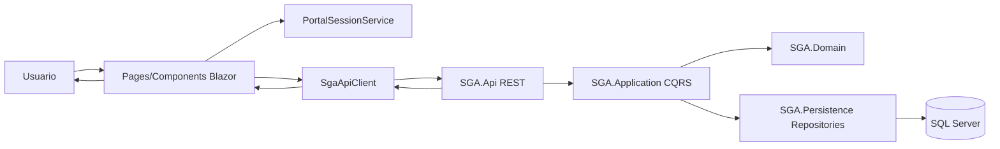

# Informe tecnico - Integracion Presentacion <-> API (SGA)

## 1. Resumen ejecutivo
Este proyecto SI implementa una integracion real entre la capa de presentacion y la API, con una base alineada a arquitectura limpia:
- Presentacion desacoplada via servicio cliente HTTP (`SgaApiClient`).
- API separada de Application/Domain/Persistence.
- DTOs para contratos de entrada/salida.
- Manejo de codigos HTTP en API y manejo de errores en cliente.

Estado general de cumplimiento:
- Cumple: separacion de responsabilidades, uso de DTOs, consumo desacoplado, flujo UI -> API -> UI.
- Cumple parcial: validaciones en frontend, manejo avanzado de errores (timeout/retry/fallback), cobertura CRUD total en todos los modulos.
- Pendiente: pruebas funcionales automatizadas y documento formal de evidencia (capturas/video) dentro del repo.

---

## 2. Arquitectura de la solucion
La solucion esta estructurada por capas:
- `SGA.Web`: capa de presentacion (Blazor Server).
- `SGA.Api`: capa de exposicion REST.
- `SGA.Application`: casos de uso (MediatR, CQRS, validaciones).
- `SGA.Domain`: reglas de negocio y entidades.
- `SGA.Persistence`: EF Core, repositorios e integracion con DB.

Arquitectura objetivo aplicada:
- UI nunca llama DB ni repositorios.
- UI consume API por HTTP.
- API delega a Application (handlers/comandos/queries).
- Domain concentra reglas de negocio.

---

## 3. Arquitectura logica de la capa de presentacion (OBLIGATORIO)

### 3.1 Componentes identificados
- Pages/Components: pantallas por rol y modulos (`Home`, `AdminPortal`, `OperatorPortal`, `DriverPortal`, `ClientStudentPortal`, etc.).
- Servicios de consumo API: `SGA.Web/Services/SgaApiClient.cs`.
- Modelos DTO/ViewModels: `SGA.Web/Models/Contracts.cs`.
- Session/seguridad de portal: `SGA.Web/Services/PortalSessionService.cs`.

### 3.2 Diagrama logico (presentacion)

### 3.3 Evaluacion de buenas practicas
- Separacion clara: SI.
- Bajo acoplamiento: SI (HttpClient + DTOs + servicios).
- Reutilizacion de servicios: SI (`SgaApiClient` centraliza llamadas).
- Logica de negocio en UI: BAJA, aunque hay algunas reglas de experiencia de usuario en componentes (aceptable).

---

## 4. Diseno de integracion con APIs

### 4.1 Endpoints consumidos (resumen)
- Instituciones: `GET/POST/PUT`.
- Buses: `GET/POST`.
- Trips: `GET/POST` + acciones `start/complete/cancel`.
- Reservations: `GET/POST` + `guest`, `board`, `cancel`.
- Users: alta de `persons/students/drivers/employees/administrators/operators`.
- Roles/Permissions: `POST/PUT`.
- Auth portal: login por rol y flujo master OTP.

### 4.2 Contratos de comunicacion
- Formato: JSON.
- DTOs concentrados en `Contracts.cs`.
- Manejo HTTP observado:
  - Exito: 200/201/204.
  - Errores controlados: 400/401/404.
  - Errores inesperados: 500 (capturados por cliente como excepcion).

### 4.3 Estrategia de consumo implementada
- `HttpClientFactory` en `Program.cs`.
- Servicio tipado `SgaApiClient`.
- Encapsulacion de llamadas (no llamadas directas HTTP desde controladores API ni acceso DB desde UI).

---

## 5. Validaciones y manejo de errores

### 5.1 Backend
- SI hay validaciones con FluentValidation + pipeline (`ValidationBehavior`).
- SI hay validaciones de reglas de negocio en handlers y domain.

### 5.2 Frontend
- SI hay validaciones basicas (campos requeridos, validaciones previas simples por formulario).
- Recomendado mejorar con `EditForm + DataAnnotationsValidator` en formularios criticos para estandarizar.

### 5.3 Errores
- SI: cliente centraliza `EnsureSuccessAsync` y muestra mensajes de API.
- Pendiente recomendado:
  - timeout global configurable,
  - retry para errores transitorios,
  - manejo visual uniforme por tipo de error.

---

## 6. Evaluacion contra actividades solicitadas

### Actividad 1 - Diseno de integracion API
- Identificacion endpoints: SI.
- DTOs entrada/salida: SI.
- Comunicacion HTTP desacoplada: SI.
- Contratos HTTP/JSON claros: SI.

### Actividad 2 - Arquitectura logica presentacion
- Componentes minimos: SI.
- Servicio API desacoplado: SI.
- ViewModels/Models: SI.
- Diagrama logico: SI (incluido arriba).

### Actividad 3 - Implementacion tecnica
- Flujo UI -> servicio -> API -> respuesta -> UI: SI.
- Integracion con UI: SI (Blazor pages).
- Validaciones distribuidas: PARCIAL (backend fuerte, frontend basico).

### Actividad 4 - Pruebas funcionales
- Casos manuales funcionales: PARCIAL (hay flujo implementado).
- Automatizacion de pruebas UI/API de integracion: NO evidenciada en repo.

---

## 7. Brechas y mejoras recomendadas (priorizadas)
1. Agregar pruebas de integracion API (xUnit) para endpoints criticos de reservas, trips y auth.
2. Agregar pruebas funcionales UI (Playwright) para flujo completo portal por rol.
3. Estandarizar validaciones frontend con `EditForm` + validadores por formulario.
4. Agregar politicas de resiliencia HTTP (timeout + retry con Polly).
5. Estandarizar respuesta de errores API con `ProblemDetails` en todos los endpoints.
6. Documentar evidencia de funcionamiento (capturas/video) en carpeta `docs/evidencias/`.

---

## 8. Conclusiones
El codigo actual cumple una parte importante de los criterios de integracion moderna API-first y arquitectura por capas. La base tecnica esta bien orientada, desacoplada y mantenible.

Para cumplir al 100% con la practica academica, faltan sobre todo:
- mayor estandar en validacion frontend,
- pruebas funcionales/integracion automatizadas,
- evidencia formal de ejecucion.

Con esas mejoras, la entrega quedaria completa y robusta tanto a nivel academico como tecnico.
