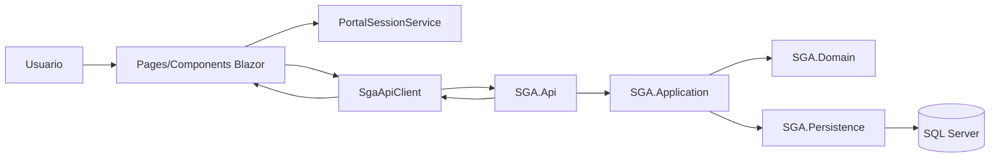

# Informe tecnico de integracion Presentacion - API (SGA)

## 1. Resumen
Este informe documenta la integracion entre la capa de presentacion y la API del proyecto SGA, con enfoque en separacion de responsabilidades, mantenimiento del desacoplamiento y trazabilidad de evidencias.

La solucion implementa un flujo completo UI -> API -> Application -> Domain -> Persistence. La capa de presentacion no contiene acceso directo a base de datos ni logica de negocio de dominio.

## 2. Arquitectura de la solucion
La solucion se organiza en capas:
- SGA.Web: interfaz web (Blazor Server).
- SGA.Api: exposicion de endpoints REST.
- SGA.Application: casos de uso, comandos, consultas, validaciones.
- SGA.Domain: entidades y reglas de negocio.
- SGA.Persistence: EF Core, repositorios y acceso a datos.

Decisiones de arquitectura aplicadas:
- La UI consume servicios HTTP tipados.
- La API delega en MediatR para comandos/consultas.
- Las validaciones se ejecutan en Application (FluentValidation) y tambien en formularios de UI.
- Los contratos entre capas se mantienen por DTOs.

## 3. Arquitectura logica de la capa de presentacion
### 3.1 Componentes principales
- Pages/Components: Home, AdminPortal, OperatorPortal, DriverPortal, ClientStudentPortal.
- Servicio de consumo API: SgaApiClient.
- Modelos de intercambio: Contracts.cs.
- Sesion y autorizacion de portal: PortalSessionService.

### 3.2 Diagrama logico

### 3.3 Evaluacion de buenas practicas
- Separacion de responsabilidades: aplicada.
- Bajo acoplamiento: aplicado mediante servicios tipados y DTOs.
- Reutilizacion de servicios: aplicada en SgaApiClient.
- Logica de negocio en UI: minimizada; la UI se limita a orquestacion y validaciones de entrada.

## 4. Diseno de integracion con APIs
### 4.1 Endpoints utilizados
- Instituciones: GET, POST, PUT.
- Buses: GET, POST, DELETE.
- Rutas: GET, POST.
- Viajes: GET, POST, start, complete, cancel.
- Reservas: GET, POST, guest, board, cancel.
- Usuarios: alta de person, driver, operator, employee, administrator, student; consulta de drivers por institucion.
- Auth de portal: login por correo y flujo OTP para master admin.

### 4.2 Contratos y formato
- Formato de intercambio: JSON.
- DTOs en capa web: Models/Contracts.cs.
- Estados HTTP esperados:
  - 200/201/204 en operaciones exitosas.
  - 400/401/404 en errores controlados.
  - 500 en excepciones no controladas.

### 4.3 Estrategia de consumo
- Registro de HttpClient por DI.
- Encapsulamiento de llamadas en SgaApiClient.
- Manejo centralizado de errores HTTP en el cliente.

## 5. Validaciones y manejo de errores
### 5.1 Backend
- Validaciones por FluentValidation y pipeline ValidationBehavior.
- Validaciones de consistencia en handlers y entidades.

### 5.2 Frontend
- Validaciones de campos requeridos en formularios criticos.
- Mensajes visibles para errores de negocio y errores de API.

### 5.3 Manejo de errores observado
- Respuesta controlada para escenarios comunes (datos invalidos, no encontrado, permisos).
- Se recomienda como siguiente paso estandarizar ProblemDetails en todos los endpoints.

## 6. Evaluacion por actividades de la practica
### Actividad 1: Integracion con APIs
Cumplida. Se definieron endpoints, DTOs, formato JSON y consumo desacoplado.

### Actividad 2: Arquitectura logica de presentacion
Cumplida. Se identificaron componentes, servicios, modelos y diagrama logico.

### Actividad 3: Implementacion tecnica
Cumplida en lo esencial. El flujo UI -> API -> UI esta operativo por modulos principales.

### Actividad 4: Pruebas funcionales
Cumplimiento parcial. Se agregaron pruebas de integracion API y pruebas unitarias de cliente web, pero faltan pruebas end-to-end completas de todos los flujos.

## 7. Brechas y mejoras priorizadas
1. Completar pruebas funcionales end-to-end para viajes y reservas.
2. Estandarizar validaciones de formularios con EditForm + DataAnnotations.
3. Unificar el formato de errores de API con ProblemDetails.
4. Aumentar cobertura automatizada para escenarios de timeout/API no disponible.
5. Mantener evidencia de ejecucion actualizada en docs/evidencias.

## 8. Matriz de cumplimiento
### 8.1 Objetivo general
Cumplido. La integracion entre presentacion y API se mantiene desacoplada y mantenible.

### 8.2 Integracion de endpoints
Cumplido. Se consumen endpoints REST con contratos claros.

### 8.3 Arquitectura logica
Cumplido. Existe separacion de componentes, servicios y modelos en la capa de presentacion.

### 8.4 Implementacion
Cumplido con mejoras en progreso. El flujo principal esta operativo por rol y modulo.

### 8.5 Pruebas
Parcial. Ya existen pruebas base, pero se requiere ampliar cobertura funcional.

### 8.6 Entregables
- Codigo fuente integrado: completado.
- Documento tecnico: completado.
- Evidencias (capturas y video): en proceso.

---

## 9. Checklist de evidencia para cierre de entrega
- Captura 1: Crear institucion y ver ID retornado (201).
- Captura 2: Listado de instituciones actualizado en UI.
- Captura 3: Crear bus y ver reflejo en consulta.
- Captura 4: Crear viaje y cambiar estado (start/complete/cancel).
- Captura 5: Reserva normal y reserva invitado.
- Captura 6: Validacion de datos invalidos (400 visible en UI).
- Captura 7: Caso no encontrado (404).
- Video corto (2-5 min): flujo UI -> API -> UI para un CRUD + manejo de error.

---

## 10. Evidencias (insertar imagenes)
Inserta aqui las capturas finales usando rutas relativas. Ejemplo:

Video (agregar enlace o ruta):
- evidencias/video_integracion_ui_api.mp4

## 11. Conclusiones
La integracion entre capa de presentacion y API se encuentra implementada y funcional en los procesos principales del sistema. La arquitectura mantiene desacoplamiento entre UI, logica de negocio y persistencia, lo cual facilita mantenimiento y evolucion.

Para cerrar la practica al 100%, el foco final debe estar en dos puntos: completar evidencia formal (capturas/video) y ampliar cobertura de pruebas funcionales de extremo a extremo.
